# AI-Briefing - 智能简报生成平台

[](https://www.docker.com/)
[](https://www.rust-lang.org/)
[](https://www.python.org/)
[](LICENSE)

AI-Briefing 是一个可扩展的智能简报生成平台，通过 ML 驱动的处理管道从多个数据源（Twitter、Reddit、Hacker News）聚合内容，利用 LLM（Gemini/OpenAI）自动生成高质量摘要。

## ✨ 核心特性

- 🔄 **多源聚合**: 支持 Hacker News、Twitter、Reddit 等主流平台
- 🧠 **ML 处理管道**: 文本嵌入 → 去重 → 聚类 → 重排序 → 摘要生成
- ⚡ **TEI 嵌入服务**: 默认容器化部署，可选 Apple Silicon Metal GPU 加速
- 🎯 **智能聚类**: HDBSCAN 算法自动识别话题，BGE-Reranker 优化相关性
- 📡 **多渠道发布**: Telegram 推送、GitHub 备份、本地文件输出
- 🚀 **一键部署**: 自动化安装与配置，开箱即用

## 🚀 快速开始

### 1. 一键安装（推荐）
```bash
# 自动安装所有依赖 (Rust + TEI + AI模型)
make setup
```

### 2. 启动服务
```bash
# 启动所有服务 (默认包含容器化 TEI)
make start
```

### 3. 开始收集数据
```bash
# 收集单个数据源
make hn            # Hacker News
make twitter       # AI 快讯 · Twitter  
make reddit        # Reddit GameDev

# 或并行收集所有数据源
make all
```

### 4. 查看结果
```bash
# 显示最新生成的摘要文件
make show

# 查看具体内容
make view-hn       # 查看 HN 摘要
make view-twitter  # 查看 Twitter 摘要
make view-reddit   # 查看 Reddit 摘要
```

## 📋 系统要求

- **macOS**: 12.0+ (推荐 Apple Silicon for Metal GPU acceleration)
- **Docker**: 20.10+
- **Docker Compose**: v2 (使用 `docker compose` 而非 `docker-compose`)
- **网络**: 稳定的互联网连接用于模型下载

**可选依赖** (make setup 自动安装):
- Rust 1.70+
- git-lfs

## ⚙️ 配置说明

### 环境变量配置
复制 `.env.example` 到 `.env` 并配置必要的 API 密钥：

```bash
# Reddit 数据源 (必需)
REDDIT_CLIENT_ID=your_reddit_client_id
REDDIT_CLIENT_SECRET=your_reddit_client_secret

GEMINI_API_KEY=your_gemini_api_key

# Telegram 推送 (可选)
TELEGRAM_BOT_TOKEN=your_bot_token

# GitHub 备份 (可选)
GITHUB_TOKEN=your_github_token

# Twitter 认证 (可选)
TWITTER_USERNAME=your_username
TWITTER_PASSWORD=your_password
TEI_MODE=compose
TEI_MODEL_ID=sentence-transformers/all-MiniLM-L6-v2
TEI_ORIGIN=http://tei:3000
HF_TOKEN=your_huggingface_token
```

### TEI 服务模式

- **compose (默认)**：`make start` 会通过 Docker Compose 启动 `tei` 容器，端口映射为 `http://localhost:8080`，容器内请求使用 `http://tei:3000`。
- **local (备用)**：设置 `TEI_MODE=local` 并将 `TEI_ORIGIN` 改为 `http://host.docker.internal:8080`，`make start` 会调用 `scripts/start-tei.sh` 在宿主机启动 Metal GPU 加速的 `text-embeddings-router`。
- 切换模式后建议运行 `make check-services`，确认 `http://localhost:8080/health` 返回正常。

### 任务配置
在 `configs/` 目录下自定义任务配置：

```yaml
briefing_id: "custom_task"
briefing_title: "自定义简报"
source:
  type: "hackernews"
  hn_story_type: "top"
  hn_limit: 50
processing:
  time_window_hours: 24
  min_cluster_size: 3
  sim_near_dup: 0.90
summarization:
output:
  formats: ["md", "json", "html"]
```

## 🏗️ 架构设计

### 处理流程

```mermaid
graph LR
    A[数据适配器] --> B[时间窗口过滤]
    B --> C[文本嵌入 TEI]
    C --> D[近似去重]
    D --> E[HDBSCAN 聚类]
    E --> F[BGE 重排序]
    F --> G[LLM 摘要生成]
    G --> H[多渠道发布]
```


### 核心组件
- **Orchestrator**: 任务编排器，管理整个处理流程
- **Data Adapters**: 统一的数据源接口 (HN/Twitter/Reddit)
- **Processing Pipeline**: ML 驱动的内容处理管道
- **Summarizer**: LLM 交互层 (支持 Gemini/OpenAI)
- **Publisher**: 多渠道内容分发器

### 服务架构
- **TEI**: 默认容器化部署，可选本地 Metal GPU 加速
- **RSSHub**: Twitter 数据代理服务
- **Redis**: 缓存后端
- **Browserless**: 无头浏览器服务

## 📊 输出格式

生成的简报文件位于 `out/<briefing_id>/` 目录：

```
out/ai-briefing-hackernews/
├── briefing_20250823T120000Z.md    # Markdown 格式
├── briefing_20250823T120000Z.json  # 结构化数据
└── briefing_20250823T120000Z.html  # HTML 格式
```

## 🛠️ 高级用法

### 开发调试
```bash
make shell         # 进入 worker 容器
make logs          # 查看实时日志
make check-services # 检查服务健康状态
```

### 服务管理
```bash
make status        # 查看服务状态
make restart       # 重启所有服务
make stop          # 停止所有服务
```

### 维护操作
```bash
make clean-output  # 清理 7 天前的输出文件
make clean-tei     # 清理 TEI 相关文件
make check-deps    # 检查系统依赖状态
```

## 🔧 故障排除

### TEI 服务问题
- **compose 模式**：
  ```bash
  docker compose --profile tei logs -f tei   # 查看容器日志
  curl http://localhost:8080/health         # 健康检查
  ```
- **local 模式**：
  ```bash
  ls ~/.cargo/bin/text-embeddings-router    # 检查二进制
  make clean-tei && make install-tei        # 重新编译安装
  ```

### Docker 网络问题
确保使用 Docker Compose v2：
```bash
docker compose version  # 应显示 v2.x.x
```

### 批处理大小错误
如果看到 "batch size > maximum allowed batch size" 错误，这是正常的批处理优化，不影响功能。

## 🤝 贡献指南

1. Fork 本仓库
2. 创建功能分支 (`git checkout -b feature/AmazingFeature`)
3. 提交更改 (`git commit -m 'Add some AmazingFeature'`)
4. 推送到分支 (`git push origin feature/AmazingFeature`)
5. 创建 Pull Request

## 📄 许可证

本项目采用 MIT 许可证 - 查看 [LICENSE](LICENSE) 文件了解详情。

## 🙏 致谢

- [Text Embeddings Inference](https://github.com/huggingface/text-embeddings-inference) - 高性能文本嵌入服务
- [RSSHub](https://github.com/DIYgod/RSSHub) - 万物皆可 RSS
- [HDBSCAN](https://github.com/scikit-learn-contrib/hdbscan) - 基于密度的聚类算法

---

**📧 反馈与支持**: 如有问题或建议，请创建 [Issue](https://github.com/yourrepo/ai-briefing/issues)
